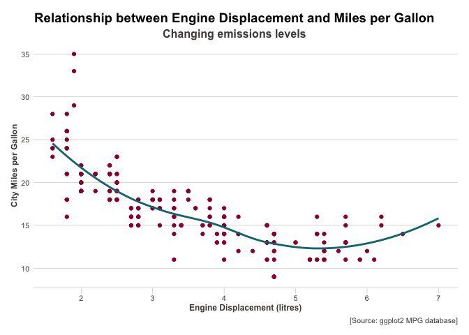

<!-- README.md is generated from README.Rmd. Please edit that file -->

# hjplottools

<!-- badges: start -->

<!-- badges: end -->

The goal of hjplottools is to provide a simple addition to ggplot2,
which will help make simple and beautiful graphs and plots.

## Installation

You can install the released version of hjplottools from
[GITHUB](https://github.com) with:

``` r
devtools::install_github("alphabetac/hjplottools")
```

## Quick Demo

This is a basic example which shows you how hj\_theme can be used to
create beautiful plots:

``` r
library(hjplottools)
library(ggplot2)

mpg %>%
  ggplot(aes(x = displ, y = cty)) +
  geom_point(colour = hj_colours("claret")) +
  geom_smooth(colour = hj_colours("teal"),
              method = "loess",
              se = F) +
  labs(
    title = "Relationship between Engine Displacement and Miles per Gallon",
    subtitle = "Changing emissions levels",
    caption = "[Source: ggplot2 MPG database]",
    x = "Engine Displacement (litres)",
    y = "City Miles per Gallon"
  ) +
  
  hj_theme()
#> `geom_smooth()` using formula 'y ~ x'
```


